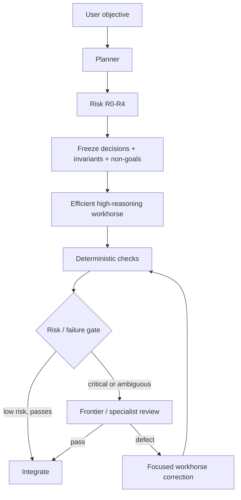

# Durable Threads

[](https://github.com/Strataward/durable-threads/actions/workflows/ci.yml)
[](LICENSE)

**Frontier decisions. Workhorse execution. Deterministic verification. Evidence-gated escalation.**

Durable Threads is a provider-neutral skill and Python helper for long-running software work across OpenAI Codex, Claude Code, Grok Build, and Cursor Agent.

It gives one planner a named set of durable worker sessions, compact implementation contracts, risk-aware review, and evidence requirements before integration. Version 0.3 adds a model-economic operating strategy designed to prevent scarce frontier-model capacity from being wasted on routine execution or status polling.

> Durable does not mean a provider process can magically recover from every failure. It means worker identity, session metadata, task state, compact evidence, and routing policy survive across bounded handoffs.

## Why this exists

A frontier model is often most valuable for the first and last parts of a difficult coding task: architecture, decomposition, ambiguity resolution, acceptance design, high-risk review, and escalation decisions.

The middle can be long and operational: implementation, repository search, focused debugging, tests, formatting, routine corrections, and waiting for another worker.

Durable Threads separates those jobs.



The planner should **sleep while healthy workers execute**. Repeated no-op polling is treated as an orchestration defect because it can repeatedly re-enter a large parent context without adding engineering value.

## Model economics

The project uses capability selectors instead of hard-coding provider model names:

- `efficient` — high-throughput workhorse;
- `balanced` — stronger general reasoning;
- `frontier` — scarce high-leverage reasoning.

For current OpenAI Codex/Work usage on a constrained Plus allowance, the default `economy` example uses:

| Role | Selector | Effort |
| --- | --- | --- |
| planner | `frontier` | `low` |
| implementation | `efficient` | `xhigh` |
| test/debug | `efficient` | `xhigh` |
| first-line reviewer | `efficient` | `xhigh` |
| security specialist | `frontier` | `medium` |

In the current GPT-5.6/GPT-6 family this can map naturally to Luna XHigh for sustained implementation and Astra Low/Medium for consequential planning/review, but Durable Threads does not assume those names will remain optimal.

Read [Model economics](skills/durable-threads/references/MODEL_ECONOMICS.md) for the policy and [the long-form article](docs/articles/frontier-decisions-cheap-execution.md) for the rationale and current evidence.

## Core design

Durable Threads combines seven controls:

1. **Decision/execution separation** — planners make architectural decisions; workhorses execute frozen contracts.
2. **Risk-aware routing** — R0–R4 consequence classes determine review depth.
3. **Compact implementation contracts** — objective, decisions, invariants, non-goals, allowed paths, acceptance, constraints.
4. **Persistent provider identity** — named sessions can be reused without replaying full transcripts.
5. **Sleeping orchestration** — the parent does not burn model turns merely watching workers.
6. **Deterministic verification first** — compiler/tests/typecheck/schema/CI before another model opinion.
7. **Evidence-gated escalation** — stronger models enter when concrete failure or risk evidence justifies them.

## Supported providers

- OpenAI Codex through native Codex app actions.
- Anthropic Claude Code through its headless CLI.
- xAI Grok Build through its headless CLI.
- Cursor Agent through its headless CLI.

Provider adapters preserve provider-specific session and model rules. Generic role selectors are mapped only where a safe mapping exists; Durable Threads does not invent provider model IDs.

## Install

Install the skill:

```text
npx skills add Strataward/durable-threads --skill durable-threads
```

Add `-g` for a user-level installation. A project can pin the skill by copying `skills/durable-threads` into `.agents/skills/`.

Install the Python helper for development:

```bash
python3 -m pip install -e '.[dev]'
```

Invoke the skill explicitly with `$durable-threads`, or allow a compatible agent runtime to select it when a task requires durable worker sessions.

## Plugin package

The repository includes `.codex-plugin/plugin.json` for Codex builds that support plugin marketplaces:

```text
codex plugin marketplace add Strataward/durable-threads
codex plugin list
```

If the runtime expects a skill path instead, use the skill installation method above.

## Economy roster

`examples/roster.json` is the reference schema-v2 economy roster.

```json
{
  "schemaVersion": 2,
  "project": { "name": "example-project" },
  "defaults": {
    "planner": {
      "role": "planner",
      "modelSelector": "frontier",
      "reasoningEffort": "low",
      "executionClass": "decision"
    },
    "reviewer": {
      "role": "reviewer",
      "modelSelector": "efficient",
      "reasoningEffort": "xhigh",
      "executionClass": "review"
    }
  },
  "strategy": {
    "profile": "economy",
    "defaultRisk": "R1",
    "frontierReviewAt": "R3",
    "sleepingOrchestrator": true,
    "escalation": [
      { "modelSelector": "efficient", "reasoningEffort": "xhigh" },
      { "modelSelector": "balanced", "reasoningEffort": "medium" },
      { "modelSelector": "frontier", "reasoningEffort": "low" },
      { "modelSelector": "frontier", "reasoningEffort": "medium" }
    ]
  }
}
```

Schema-v1 rosters remain loadable. See [Migration to v2](docs/MIGRATION_V2.md).

## Risk model

Risk measures consequence, not difficulty.

| Class | Meaning | Examples |
| --- | --- | --- |
| R0 | mechanical | docs, formatting, typo, narrow rename |
| R1 | bounded | isolated feature or bug fix |
| R2 | integration | APIs, webhooks, queues, caches, multi-module contracts |
| R3 | critical | auth, payments, privacy, destructive migration, concurrency |
| R4 | systemic | distributed architecture, control plane, multi-region recovery |

The Python router performs deterministic, explainable classification. An explicit planner override always wins.

See [Risk-aware routing](skills/durable-threads/references/RISK_ROUTING.md).

## Implementation contracts

An efficient model becomes much stronger when architecture is frozen before execution.

A good packet looks like:

```text
OBJECTIVE
Implement refresh-token rotation.

DECISIONS ALREADY MADE
- Redis remains the state store.
- Replay invalidates the token family.

INVARIANTS
- Existing access-token behavior remains unchanged.
- Refresh tokens are never stored plaintext.

NON-GOALS
- Do not redesign the JWT abstraction.
- Do not modify session UI.

ALLOWED PATHS
- src/auth/**
- tests/auth/**

ACCEPTANCE
- Refresh succeeds exactly once.
- Replay is rejected and descendants are invalidated.
- Focused tests pass.
- Type checking passes.
```

The Python `DelegationPacket` supports `decisions`, `invariants`, `non_goals`, `risk_class`, and `execution_class` while retaining compatibility with existing callers.

See [Packet contract](skills/durable-threads/references/PACKET_CONTRACT.md).

## Planning from the CLI

Create compact packets with the reference roster:

```bash
durable-threads plan \
  --roster examples/roster.json \
  --objective "Fix the reading-level fallback and add regression tests." \
  --allowed-path packages/shared/src/reading-level.ts \
  --allowed-path packages/shared/src/reading-level.test.ts \
  --acceptance "Known profile labels keep their current mapping." \
  --acceptance "Inherited property names return the safe fallback." \
  --acceptance "The focused test and type check pass." \
  --constraint "Do not read environment files or credentials." \
  --run-id storibuk-reading-level
```

The router selects only workers justified by the task. It does not start a provider session.

Use explicit workers when the planner has better information:

```bash
durable-threads plan \
  --roster examples/roster.json \
  --worker implementation \
  --worker security-review \
  --objective "Harden the session boundary." \
  --allowed-path src/durable_threads/providers.py \
  --acceptance "The focused security checks pass."
```

## Provider commands

Render a provider-specific command without executing it:

```bash
durable-threads provider-command \
  --provider claude \
  --model sonnet \
  --effort medium \
  --prompt "Complete the bounded task and report exact checks."
```

The helper can explicitly dispatch supported CLI providers. Native Codex task orchestration remains an app/runtime responsibility.

## Evidence and integration

A complete result must contain:

```json
{
  "status": "complete",
  "provider": "codex",
  "changedPaths": ["src/example.py"],
  "checks": ["pytest tests/test_example.py: passed"],
  "remainingConcerns": ["None known"]
}
```

`verify-result` can compare reported changed paths against the actual git diff. It does **not** execute the reported tests itself. The planner should rerun integration- and security-relevant checks before integration.

## Sleeping orchestrator

Do not build this:

```text
frontier parent -> spawn worker -> poll -> parent resampled -> poll -> parent resampled
```

Build this:

```text
frontier parent decides -> dispatch bounded worker -> sleep -> completion/material evidence wakes planner
```

Recent Codex issue reports describe repeated parent-context processing caused by short wait timeouts. See [Model economics](skills/durable-threads/references/MODEL_ECONOMICS.md) for references.

## Escalation

Default economy ladder:

```text
efficient/xhigh
    ↓ repeated concrete failure
balanced/medium
    ↓ architecture ambiguity
frontier/low
    ↓ unresolved difficult decision
frontier/medium
```

High/XHigh/Max frontier effort is intentionally not a default rung. Use it when benchmark evidence or the task's consequence justifies it.

## Persistent sessions

Each worker can retain a provider session ID locally. Do not commit real IDs. A retained session is useful only when its context remains relevant. New objectives get new task records and run IDs even when the same worker session is reused.

See [Persistent thread lifecycle](skills/durable-threads/references/PERSISTENT_THREADS.md).

## Safety boundaries

Durable Threads does not treat path allow-lists as a filesystem sandbox, store credentials, copy full transcripts into packets, infer permission to push/merge/deploy/publish, blindly recover unknown provider writer state, bypass retry limits, or claim token savings without matched evidence.

## Benchmarking

Measure input/output/reasoning tokens when available, cached context, parent turns, no-op waits, first-pass acceptance, deterministic failures, review defects, correction count, wall time, and final acceptance.

See [Benchmarking](skills/durable-threads/references/BENCHMARKING.md).

## Documentation

- [Architecture](skills/durable-threads/references/ARCHITECTURE.md)
- [Model economics](skills/durable-threads/references/MODEL_ECONOMICS.md)
- [Astra operating guide](skills/durable-threads/references/ASTRA.md)
- [Risk-aware routing](skills/durable-threads/references/RISK_ROUTING.md)
- [Implementation packet contract](skills/durable-threads/references/PACKET_CONTRACT.md)
- [Operating policy](skills/durable-threads/references/OPERATING_POLICY.md)
- [Persistent threads](skills/durable-threads/references/PERSISTENT_THREADS.md)
- [Provider adapters](skills/durable-threads/references/PROVIDERS.md)
- [Validation](skills/durable-threads/references/VALIDATION.md)
- [Comparison protocol](skills/durable-threads/references/COMPARISON.md)
- [Benchmarking](skills/durable-threads/references/BENCHMARKING.md)
- [Migration to v2](docs/MIGRATION_V2.md)
- [Article: Stop Using Your Best Model as a Worker](docs/articles/frontier-decisions-cheap-execution.md)

## Historical approach

The repository state immediately before the model-economic v0.3 redesign is preserved at `archive/pre-model-economics-2026-09-12`.

## Development

```bash
python3 -m pip install -e '.[dev]'
pytest
ruff check .
python scripts/validate_repo.py
```

## Status

Durable Threads is alpha software. Provider CLIs, model names, product allowances, and Codex multi-agent behavior can change quickly. The project therefore favors live discovery, explicit policy, deterministic evidence, and dated benchmarks over hard-coded assumptions.

## License

Apache-2.0.
