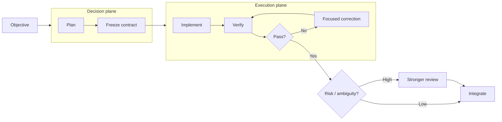

# Durable Threads

[](https://github.com/Strataward/durable-threads/actions/workflows/ci.yml)
[](LICENSE)

**Frontier decisions. Workhorse execution. Deterministic verification. Evidence-gated escalation.**

Durable Threads is a Codex plugin for delegating engineering work without keeping your most expensive model in every part of the loop. It ships one canonical `durable-threads` skill and works with sensible defaults: no roster, Python package, extra provider, or model configuration is required to get started.

The **plugin is the installable package**. The bundled **skill is the workflow**. You do not install or maintain them separately.

## Quick start

Add the repository marketplace and install the plugin:

```bash
codex plugin marketplace add Strataward/durable-threads --ref main
codex plugin add durable-threads@strataward
```

Start a new Codex session, then ask naturally:

```text
Use Durable Threads to implement this feature efficiently and verify the result.
```

You can also use `/plugins`, choose **Add Marketplace**, enter `Strataward/durable-threads`, and install **Durable Threads** from the `Strataward` marketplace.

That is the complete basic setup.

> Using the Codex IDE extension? Plugins are not currently supported there. Use the [standalone skill fallback](docs/INSTALLATION.md#ide--standalone-skill-fallback).

## What it does

The default workflow separates decision-making from sustained execution:



The planner should sleep while a healthy worker executes. It wakes when there is a result, a failure, new evidence, or a real decision to make—not just to poll status.

The default policy is role-based rather than tied to temporary model IDs:

| Job | Starting policy |
| --- | --- |
| bounded implementation / debugging | efficient model + high reasoning |
| difficult general planning | balanced model + medium reasoning |
| consequential architecture / review | frontier model + low or medium reasoning |
| R3/R4 security or systemic work | independent specialist/frontier review |

With OpenAI's current model family, that can map naturally to Luna XHigh-like workhorse execution and Astra Low/Medium-like decision work. Durable Threads resolves against live model availability where possible rather than assuming today's model names will remain permanent.

## Progressive customization

Most users should stop at the quick start. Add configuration only when it solves a concrete problem:

1. **Per task:** state a risk level, model/effort preference, or review requirement in the prompt.
2. **Per repository:** put stable policy in your project's `AGENTS.md`.
3. **Deterministic orchestration:** use the optional Python helper and roster for reproducible routing, benchmarks, or explicit persistent workers.
4. **Multi-provider:** configure Claude Code, Grok Build, or Cursor only when you actually want those external workers.

See [Customization](docs/CUSTOMIZATION.md).

## Why the plugin contains a skill

OpenAI's current model is straightforward: **skills author reusable workflows; plugins distribute them**. Durable Threads follows that layout with one source of truth:

```text
.agents/plugins/marketplace.json
plugins/
  durable-threads/
    .codex-plugin/plugin.json
    skills/
      durable-threads/
        SKILL.md
        agents/
        references/
```

There is no duplicate top-level skill to keep in sync.

## Risk model

Risk measures consequence, not how difficult the code feels:

| Class | Meaning | Typical examples |
| --- | --- | --- |
| R0 | mechanical | docs, formatting, typo, narrow rename |
| R1 | bounded | isolated feature or bug fix |
| R2 | integration | API contracts, queues, webhooks, caches |
| R3 | critical | auth, payments, privacy, destructive migration, concurrency |
| R4 | systemic | distributed architecture, control plane, recovery design |

R0/R1 usually need good deterministic checks, not an expensive independent review. R3/R4 justify stronger independent review by default.

## Implementation contracts

Workers receive the information needed to execute, not the planner's entire transcript:

```text
OBJECTIVE
Implement refresh-token rotation.

DECISIONS ALREADY MADE
- Redis remains the state store.
- Replay invalidates the token family.

INVARIANTS
- Existing access-token behavior stays unchanged.
- Refresh tokens are never stored plaintext.

NON-GOALS
- Do not redesign the JWT abstraction.

ALLOWED PATHS
- src/auth/**
- tests/auth/**

ACCEPTANCE
- Refresh succeeds exactly once.
- Replay is rejected.
- Focused tests and typecheck pass.
```

A bounded contract is what makes an efficient high-reasoning worker useful: important decisions are made once, the write scope is explicit, and correctness is checked independently.

## Optional advanced helper

The repository also includes a Python helper for teams and experiments that need deterministic routing, provider session IDs, structured evidence, CLI dispatch, or benchmark records. It is deliberately optional.

If you do not know why you need a roster, you do not need one.

Development install:

```bash
python3 -m pip install -e '.[dev]'
```

Reference configurations live in `examples/`. Installing Durable Threads does not install or authenticate Claude Code, Grok Build, or Cursor Agent; those adapters are opt-in.

## Documentation

- [Installation and supported surfaces](docs/INSTALLATION.md)
- [Customization: simple → advanced](docs/CUSTOMIZATION.md)
- [OpenAI compatibility / documentation audit](docs/OPENAI_COMPATIBILITY.md)
- [Architecture](plugins/durable-threads/skills/durable-threads/references/ARCHITECTURE.md)
- [Model economics](plugins/durable-threads/skills/durable-threads/references/MODEL_ECONOMICS.md)
- [Risk-aware routing](plugins/durable-threads/skills/durable-threads/references/RISK_ROUTING.md)
- [Implementation packet contract](plugins/durable-threads/skills/durable-threads/references/PACKET_CONTRACT.md)
- [Operating policy](plugins/durable-threads/skills/durable-threads/references/OPERATING_POLICY.md)
- [Persistent threads](plugins/durable-threads/skills/durable-threads/references/PERSISTENT_THREADS.md)
- [Provider adapters](plugins/durable-threads/skills/durable-threads/references/PROVIDERS.md)
- [Benchmarking](plugins/durable-threads/skills/durable-threads/references/BENCHMARKING.md)
- [Long-form article](docs/articles/frontier-decisions-cheap-execution.md)

## Compatibility history

- Pre-simplification v0.3 state: `archive/pre-simplified-setup-2026-09-12`
- Pre-model-economics state: `archive/pre-model-economics-2026-09-12`

## Development

```bash
python3 -m pip install -e '.[dev]'
pytest
ruff check .
python scripts/validate_repo.py
```

Durable Threads is alpha software. Codex plugin/skill surfaces and model catalogs can change quickly, so compatibility documentation is dated and checked against current upstream sources.

## License

Apache-2.0.
