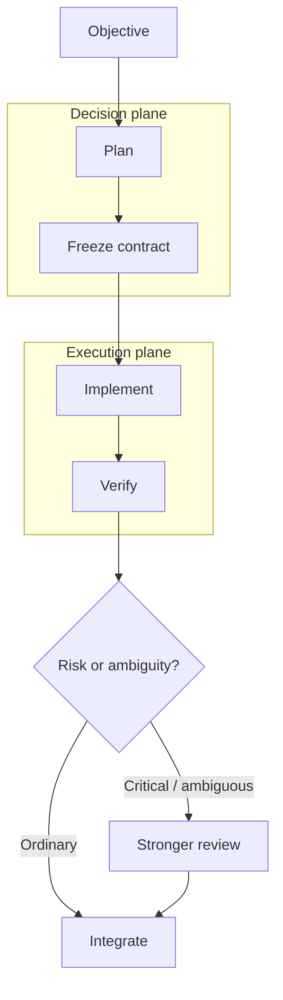

# Durable Threads

[](https://github.com/Strataward/durable-threads/actions/workflows/ci.yml)
[](LICENSE)

**Frontier decisions. Workhorse execution. Deterministic verification. Evidence-gated escalation.**

Durable Threads is one Codex plugin with one canonical bundled skill. Install it, start a new session, and use it. No roster, Python package, extra provider, or model configuration is required for normal use.

The plugin is the **distribution unit**. The bundled `durable-threads` skill is the **workflow implementation**. They are not two separate products.

## Quick start

### Codex CLI

Add this repository as a plugin marketplace and install Durable Threads:

```bash
codex plugin marketplace add Strataward/durable-threads --ref main
codex plugin add durable-threads@strataward
```

Start a new Codex session so the bundled skill is loaded. Then ask naturally:

```text
Use Durable Threads to implement this feature efficiently and verify the result.
```

You can also open `/plugins`, choose **Add Marketplace**, enter `Strataward/durable-threads`, and install **Durable Threads** from the `Strataward` marketplace.

That is the complete basic setup.

> Using the Codex IDE extension? Plugins are not currently supported there. See [IDE / standalone skill fallback](docs/INSTALLATION.md#ide--standalone-skill-fallback).

## What it does by default

Durable Threads applies one compact workflow without asking you to configure workers first:



The planner should sleep while healthy workers execute instead of repeatedly spending expensive parent turns polling status.

The default economic policy is role-based rather than model-name-based:

| Job | Starting policy |
| --- | --- |
| bounded implementation / debugging | efficient model + high reasoning |
| difficult general planning | balanced model + medium reasoning |
| consequential architecture / review | frontier model + low or medium reasoning |
| R3/R4 security or systemic work | independent specialist/frontier review |

When the current OpenAI catalog exposes Luna/Astra-style tiers, this naturally supports Luna XHigh-like workhorse execution and Astra Low/Medium-like decision work. Durable Threads discovers live model availability instead of assuming model IDs will stay fixed.

## One product, progressive customization

Most users should stop at the quick start.

When you need more control, customize in layers:

1. **Per task:** tell Durable Threads what model/effort, risk level, or review policy you want.
2. **Per repository:** put stable preferences in your project's `AGENTS.md`.
3. **Deterministic orchestration:** use the optional Python helper and a roster when you need reproducible routing, benchmarking, or explicit persistent workers.
4. **Multi-provider:** configure Claude Code, Grok Build, or Cursor only if you actually want those external workers.

See [Customization](docs/CUSTOMIZATION.md). The optional helper is not required by the plugin.

## Why the plugin contains a skill

OpenAI's current Codex guidance separates authoring from distribution: a **skill** is the reusable workflow format; a **plugin** can bundle that skill so other users can install it. Durable Threads follows that model exactly.

Canonical layout:

```text
.agents/plugins/marketplace.json
plugins/
  durable-threads/
    .codex-plugin/plugin.json
    skills/
      durable-threads/
        SKILL.md
        agents/
        references/
```

There is only one copy of the workflow source.

## Risk model

Risk measures consequence, not how annoying the task is:

| Class | Meaning | Typical examples |
| --- | --- | --- |
| R0 | mechanical | docs, formatting, typo, narrow rename |
| R1 | bounded | isolated feature or bug fix |
| R2 | integration | API contracts, queues, webhooks, caches |
| R3 | critical | auth, payments, privacy, destructive migration, concurrency |
| R4 | systemic | distributed architecture, control plane, recovery design |

R0/R1 usually need deterministic checks, not an expensive independent review. R3/R4 justify stronger review by default.

## Implementation contracts

Workers get the information required to execute rather than a full planner transcript:

```text
OBJECTIVE
Implement refresh-token rotation.

DECISIONS ALREADY MADE
- Redis remains the state store.
- Replay invalidates the token family.

INVARIANTS
- Existing access-token behavior stays unchanged.
- Refresh tokens are never stored plaintext.

NON-GOALS
- Do not redesign the JWT abstraction.

ALLOWED PATHS
- src/auth/**
- tests/auth/**

ACCEPTANCE
- Refresh succeeds exactly once.
- Replay is rejected.
- Focused tests and typecheck pass.
```

This is what makes a cheaper high-reasoning worker effective: architecture is decided once, execution is bounded, and correctness is checked independently.

## Optional advanced helper

The repository also contains a Python helper for teams and experiments that need deterministic routing, provider session IDs, structured evidence, CLI dispatch, or benchmark records.

It is deliberately **advanced/optional**. If you do not know why you need a roster, you do not need one.

Development install:

```bash
python3 -m pip install -e '.[dev]'
```

Reference configurations live in `examples/`. Multi-provider adapters do not become active merely by installing the plugin; the relevant provider CLIs and sessions must be configured separately.

## Documentation

Start here:

- [Installation and supported surfaces](docs/INSTALLATION.md)
- [Customization: simple → advanced](docs/CUSTOMIZATION.md)
- [OpenAI compatibility / documentation audit](docs/OPENAI_COMPATIBILITY.md)
- [Architecture](plugins/durable-threads/skills/durable-threads/references/ARCHITECTURE.md)
- [Model economics](plugins/durable-threads/skills/durable-threads/references/MODEL_ECONOMICS.md)
- [Risk-aware routing](plugins/durable-threads/skills/durable-threads/references/RISK_ROUTING.md)
- [Packet contract](plugins/durable-threads/skills/durable-threads/references/PACKET_CONTRACT.md)
- [Operating policy](plugins/durable-threads/skills/durable-threads/references/OPERATING_POLICY.md)
- [Persistent threads](plugins/durable-threads/skills/durable-threads/references/PERSISTENT_THREADS.md)
- [Provider adapters](plugins/durable-threads/skills/durable-threads/references/PROVIDERS.md)
- [Benchmarking](plugins/durable-threads/skills/durable-threads/references/BENCHMARKING.md)
- [Long-form article](docs/articles/frontier-decisions-cheap-execution.md)

## Compatibility history

- Pre-simplification v0.3 state: `archive/pre-simplified-setup-2026-09-12`
- Pre-model-economics state: `archive/pre-model-economics-2026-09-12`

## Development

```bash
python3 -m pip install -e '.[dev]'
pytest
ruff check .
python scripts/validate_repo.py
```

Durable Threads is alpha software. Codex plugin/skill surfaces and model catalogs can change quickly, so installation and compatibility documentation is dated and tied to current OpenAI sources rather than treated as permanent behavior.

## License

Apache-2.0.
