# Durable Threads

[](https://github.com/Strataward/durable-threads/actions/workflows/ci.yml)
[](LICENSE)

**Frontier decisions. Workhorse execution. Native agents. Deterministic verification.**

Durable Threads is a risk- and cost-aware policy layer for coding-agent runtimes. On modern Codex it prefers **native subagents** for execution and keeps Durable Threads focused on the higher-value decisions: whether to delegate, how to scope the work, which model/effort class should own it, how much parallelism is safe, what evidence is required, and when escalation is justified.

OpenAI provides the multi-agent runtime. **Durable Threads decides how to use it well.**

The **plugin is the installable package**. The bundled **skill is the workflow**. The optional Python helper exists for deterministic routing, benchmarks, and provider-neutral experiments; normal Codex use does not require it.

## Quick start

Add the repository marketplace and install the plugin:

```bash
codex plugin marketplace add Strataward/durable-threads --ref main
codex plugin add durable-threads@strataward
```

Start a new Codex session, then ask naturally:

```text
Use Durable Threads to implement this feature efficiently and verify the result.
```

### Update an installed copy

If Durable Threads is already installed from the `strataward` marketplace, refresh the marketplace snapshot and reinstall the plugin:

```bash
codex plugin marketplace upgrade strataward && codex plugin add durable-threads@strataward
```

Then start a **new Codex session** so the updated skill and plugin metadata are loaded.

See [Installation](docs/INSTALLATION.md) for details and fallback paths.

> Using the Codex IDE extension? If plugin installation is unavailable on that surface, use the [standalone skill fallback](docs/INSTALLATION.md#ide--standalone-skill-fallback).

## What changed in v0.5

Codex now has a first-class native multi-agent runtime with built-in `explorer` and `worker` roles, configurable subagent model/reasoning defaults, concurrency controls, custom agent roles, native waiting/resume behavior, and experimental worktree support. Durable Threads now treats those capabilities as the preferred Codex execution substrate rather than trying to recreate them.

The core rule is:

> **Use the host's native agent runtime whenever it is capable enough. Durable Threads owns policy, not process management.**

That yields a cleaner architecture:

```mermaid
flowchart LR
    U["User objective"] --> DT

    subgraph DT["Durable Threads policy"]
        direction TB
        D["Delegate?"] --> R["Classify R0-R4"]
        R --> C["Freeze contract"]
        C --> M["Choose role / model / effort"]
        M --> P["Choose parallelism / isolation"]
    end

    P --> RT

    subgraph RT["Execution runtime"]
        direction TB
        E["Native explorer"]
        W["Native worker"]
        X["Custom reviewer / specialist"]
    end

    RT --> V["Deterministic verification"]
    V --> G{"Risk / ambiguity gate"}
    G -->|"pass"| I["Integrate"]
    G -->|"needs review"| Q["Independent review / escalation"]
    Q --> I
```



## Native Codex policy

Durable Threads maps common work onto Codex's native roles instead of inventing a parallel scheduler:

| Work | Preferred native shape |
| --- | --- |
| codebase questions / read-heavy discovery | `explorer` |
| bounded implementation / debugging | `worker` |
| routine independent review | read-only custom reviewer when available, otherwise default agent |
| R3/R4 security review | read-only specialist/frontier reviewer |
| architecture / consequential decision | main planner/integrator |

The model policy remains economic rather than prestige-driven:

| Job | Starting policy |
| --- | --- |
| bounded implementation / debugging | efficient model + high/XHigh reasoning |
| difficult general planning | balanced model + medium reasoning |
| consequential architecture / review | frontier model + low or medium reasoning |
| R3/R4 security or systemic work | independent specialist/frontier review |

Durable Threads resolves against live model availability where possible instead of treating today's model IDs as permanent.

## Subagents for cognition, worktrees for mutation

Native subagents share the active project environment. That is excellent for parallel reading and analysis, but multiple writers need stronger coordination.

Durable Threads therefore uses this default rule:

- parallel explorers/reviewers: safe when independent and read-only;
- one bounded writer: shared checkout is fine;
- multiple independent writers: prefer isolated worktrees when the runtime supports them;
- overlapping write ownership: serialize instead of hoping a merge resolves semantic conflicts.

**Subagents for parallel cognition. Worktrees for parallel mutation.**

The optional Python helper exposes the same idea through `durable_threads.native.recommend_native_execution(...)`, which returns inspectable execution hints without spawning Codex itself.

## Implementation contracts

Delegation is driven by a bounded contract, not a transcript dump:

```text
OBJECTIVE
Implement refresh-token rotation.

DECISIONS ALREADY MADE
- Redis remains the state store.
- Replay invalidates the token family.

INVARIANTS
- Existing access-token behavior stays unchanged.
- Refresh tokens are never stored plaintext.

NON-GOALS
- Do not redesign the JWT abstraction.

ALLOWED PATHS
- src/auth/**
- tests/auth/**

ACCEPTANCE
- Refresh succeeds exactly once.
- Replay is rejected.
- Focused tests and typecheck pass.
```

The planner makes important decisions once; the workhorse executes against a narrow contract; machines verify what machines can verify; stronger review is added only when consequence or evidence warrants it.

## Risk model

Risk measures consequence, not how difficult the code feels:

| Class | Meaning | Typical examples |
| --- | --- | --- |
| R0 | mechanical | docs, formatting, typo, narrow rename |
| R1 | bounded | isolated feature or bug fix |
| R2 | integration | API contracts, queues, webhooks, caches |
| R3 | critical | auth, payments, privacy, destructive migration, concurrency |
| R4 | systemic | distributed architecture, control plane, recovery design |

R0/R1 usually need strong deterministic checks rather than expensive independent review. R3/R4 justify independent specialist/frontier review by default.

## Optional custom Codex roles

The repository includes read-only examples under `examples/codex-agents/`:

```text
examples/codex-agents/
  dt-reviewer.toml
  dt-security.toml
```

Teams that want persistent native reviewer roles can copy/adapt them into the repository's `.codex/agents/` directory. They intentionally do not pin a model ID; model choice remains a routing decision unless reproducibility requires a pin.

## Durable mode: Temporal + Jev

Native Codex remains the zero-infrastructure default. For long-lived or cross-provider work, Durable Threads now has an optional **durable mode** built around two deeper primitives:

- **TypeSafe Jev** supplies fast, typed probabilistic judgments for risk, delegation, ambiguity, execution shape, evidence sufficiency, and escalation.
- **Temporal** owns durable workflow state, child execution, retries, signals, crash recovery, and human-review waits.
- **Durable Threads policy** remains deterministic authority: Jev confidence is evidence, never permission by itself.
- **ExecutionRegistry** selects providers by capabilities and supports third-party `durable_threads.executors` entry points instead of a closed provider enum.
- **Evidence verification** compares worker claims with the actual git diff before semantic acceptance.

The policy loop is:

```text
task
  -> Jev task assessment
  -> deterministic risk floor / policy gate
  -> capability-based executor routing
  -> Temporal child execution
  -> deterministic evidence verification
  -> Jev result assessment
  -> accept / correct / switch / strengthen / human review
```

Install the optional durable stack:

```bash
python3 -m pip install -e '.[durable]'
```

Run a worker:

```bash
durable-threads-temporal-worker
```

Start a durable task:

```bash
durable-threads-temporal start \
  --objective 'Implement refresh-token rotation' \
  --allowed-path 'src/auth/**' \
  --acceptance 'Replay is rejected' \
  --cwd /path/to/repository
```

Try it without a provider or a TypeSafe key:

```bash
docker compose -f ops/temporal/docker-compose.yml up -d
python3 -m pytest tests/test_temporal_workflows.py
python3 scripts/bench_durable.py --runs 5
python3 scripts/bench_durable.py --scenario gate-recovery --runs 1
```

Write-capable workers are deliberately serialized on a shared checkout. Parallel mutation requires real workspace isolation; Durable Threads will not race multiple writers against the same working tree merely because Jev suggests `parallel_workers`.

See [Temporal + Jev durable mode](docs/TEMPORAL_JEV.md).

## Optional advanced helper

The Python helper supports deterministic rosters, R0-R4 routing, provider session IDs, structured evidence, benchmark records, and native-runtime execution hints.

Development install:

```bash
python3 -m pip install -e '.[dev]'
```

Reference configurations live in `examples/`. Installing Durable Threads does not install or authenticate Claude Code, Grok Build, or Cursor Agent; those adapters remain opt-in.

## Runtime strategy

The preferred runtime order is:

1. **Native Codex subagents** for normal interactive Codex work.
2. **Temporal durable mode** for long-running, crash-resilient, cross-provider, or human-gated work.
3. **OpenAI Agents API** as an optional managed/headless execution backend when its platform lifecycle is the right fit.
4. **Claude Code / Grok Build / Cursor / executor plugins** when external-provider execution is intentionally requested.

Durable Threads does not duplicate native Codex spawn/wait/resume machinery unless a measurable capability gap requires it. Temporal is an optional durability substrate, not a prerequisite for the plugin.

## Documentation

- [Installation and plugin updates](docs/INSTALLATION.md)
- [Native Codex multi-agent integration](docs/NATIVE_MULTI_AGENT.md)
- [Temporal + Jev durable mode](docs/TEMPORAL_JEV.md)
- [Customization: simple -> advanced](docs/CUSTOMIZATION.md)
- [OpenAI compatibility / documentation audit](docs/OPENAI_COMPATIBILITY.md)
- [Architecture](plugins/durable-threads/skills/durable-threads/references/ARCHITECTURE.md)
- [Model economics](plugins/durable-threads/skills/durable-threads/references/MODEL_ECONOMICS.md)
- [Risk-aware routing](plugins/durable-threads/skills/durable-threads/references/RISK_ROUTING.md)
- [Implementation packet contract](plugins/durable-threads/skills/durable-threads/references/PACKET_CONTRACT.md)
- [Operating policy](plugins/durable-threads/skills/durable-threads/references/OPERATING_POLICY.md)
- [Provider adapters](plugins/durable-threads/skills/durable-threads/references/PROVIDERS.md)
- [Benchmarking](plugins/durable-threads/skills/durable-threads/references/BENCHMARKING.md)
- [Durable mode overhead benchmark](docs/benchmarks/2026-09-19-durable-mode-overhead.md)
- [ADR 0001: Rust / WebAssembly decision](docs/adr/0001-rust-wasm.md)
- [ADR 0002: TypeScript SaaS control plane](docs/adr/0002-typescript-saas.md)
- [Hosted SaaS](docs/SAAS.md)
- [Long-form article](docs/articles/frontier-decisions-cheap-execution.md)

## Compatibility history

- Pre-native-multi-agent v0.4 state: `archive/pre-native-multi-agent-2026-09-12`
- Pre-simplification v0.3 state: `archive/pre-simplified-setup-2026-09-12`
- Pre-model-economics state: `archive/pre-model-economics-2026-09-12`

## Development

```bash
python3 -m pip install -e '.[dev]'
pytest
ruff check .
python -m compileall -q src scripts
python scripts/validate_repo.py
npm install
npm test
```

Durable mode: the Python checks above are unchanged. Run `tests/test_temporal_workflows.py` after installing `.[durable]`. The hosted TypeScript control plane is documented in [docs/SAAS.md](docs/SAAS.md).

Durable Threads is alpha software. Codex plugin, subagent, model, and worktree surfaces can change quickly, so compatibility documentation is dated and should be rechecked against current upstream sources.

## License

Apache-2.0.
