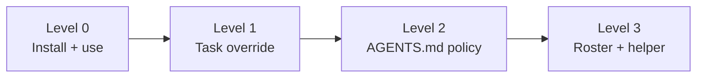
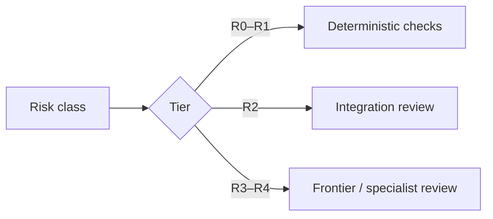

# Customization

Durable Threads uses progressive disclosure: start with zero project configuration and add policy only when it solves a real problem.



Most users should remain at Level 0 or Level 1.

## Level 0 — use the defaults

Install the plugin and ask it to do the work:

```text
Use Durable Threads to implement this feature efficiently and verify it.
```

The bundled skill decides whether a handoff is useful, classifies consequence, freezes a bounded contract, prefers deterministic checks, and escalates only when evidence or risk warrants it.

## Level 1 — override one task

Put the exception in the prompt. No configuration file is needed for a one-off preference.

```text
Use Durable Threads. Keep implementation on the efficient high-reasoning model and require frontier review only if this becomes R3+.
```

```text
Treat this authentication change as R3 and require independent security review.
```

```text
Do not delegate this one; keep it in the current task.
```

## Level 2 — repository policy in AGENTS.md

Use `AGENTS.md` when a preference should apply consistently in one repository. Prefer durable roles and safety policy over temporary model IDs.

```markdown
## Durable Threads

- Use efficient high reasoning for bounded implementation.
- Treat auth, payments, permissions, privacy, destructive migrations, and concurrency as R3 or higher.
- Require deterministic checks before model review.
- Use frontier review at R3+.
- Do not poll healthy workers repeatedly.
```

For many teams, this is enough structure without introducing a roster.

## Level 3 — explicit roster and Python helper

Use the optional helper when you need reproducible routing for benchmarks, named persistent sessions, explicit parallel-worker limits, structured provider/session ledgers, deterministic provider command rendering, or multi-provider Claude/Grok/Cursor workers.

Start from `examples/roster.json` for Codex-oriented experiments or `examples/multi-provider-roster.json` for explicit provider splits.

The helper is intentionally outside the quick-start path.

## Model selection

Prefer durable roles over volatile names:

- `efficient` for sustained bounded execution;
- `balanced` for harder general reasoning;
- `frontier` for consequential decisions and independent review.

Reasoning effort is a separate dimension. An efficient model at high/XHigh reasoning can be a strong implementer when the contract is well specified. Raise frontier effort when consequence or observed failure justifies it—not because a task sounds important.

If the runtime exposes a live catalog, resolve against it. Pin a concrete model ID only when you intentionally want a reproducible experiment.

## Review policy



Override risk explicitly when repository facts are stronger than the classifier.

## Multi-provider setup

Installing Durable Threads does not install or authenticate Claude Code, Grok Build, or Cursor Agent. Those adapters are optional. Configure them only if you want external workers, then use `plugins/durable-threads/skills/durable-threads/references/PROVIDERS.md`.
