# Native Codex multi-agent integration

Last verified: **2026-09-19**.

Durable Threads treats current Codex multi-agent capabilities as the preferred execution substrate. The project no longer needs to recreate low-level Codex thread management simply to obtain parallel workers.

The division of responsibility is deliberate:

- **Durable Threads** owns delegation policy, R0-R4 consequence classification, implementation contracts, model/effort policy, safe parallelism, evidence requirements, escalation, and integration gates.
- **Codex** owns native subagent lifecycle, agent-role application, waiting/resume behavior, sandbox enforcement, shared project state, and worktree/session mechanics.

## Why this matters

Native multi-agent support changes the right abstraction boundary. Durable Threads should not compete with Codex on spawning or supervising Codex children. It should compile engineering policy into native runtime choices.

```mermaid
flowchart LR
    U["Objective"] --> P

    subgraph P["Durable Threads policy"]
        direction TB
        H["Handoff useful?"] --> R["Risk R0-R4"]
        R --> C["Freeze contract"]
        C --> A["Agent role"]
        A --> M["Model / effort"]
        M --> W["Workspace / fan-out"]
    end

    W --> N

    subgraph N["Native Codex runtime"]
        direction TB
        E["explorer"]
        X["worker"]
        Q["custom/default reviewer"]
    end

    N --> V["Deterministic verification"]
    V --> G["Durable risk gate"]
```



## Built-in role mapping

Current Codex includes built-in `explorer` and `worker` roles. Durable Threads uses them as the default vocabulary:

| Durable Threads work | Native Codex role | Default access shape |
| --- | --- | --- |
| codebase question / read-heavy discovery | `explorer` | shared read-only intent |
| implementation / bug fix | `worker` | bounded write ownership |
| test/debug implementation | `worker` | bounded write ownership |
| independent review | custom read-only reviewer when installed; otherwise `default` | read-only |
| R3/R4 security review | custom read-only security role when installed; otherwise `default` with explicit specialist contract | read-only |

The Python helper mirrors this with `durable_threads.native.codex_agent_role` and `recommend_native_execution`. These functions return recommendations only; they do not spawn Codex.

## Implementation contracts remain the core primitive

A native worker should still receive a bounded packet:

```text
OBJECTIVE
DECISIONS ALREADY MADE
INVARIANTS
NON-GOALS
ALLOWED PATHS / OWNERSHIP
ACCEPTANCE CHECKS
RISK CLASS
RESULT CONTRACT
```

Native orchestration does not remove the need for good delegation. It makes bounded delegation cheaper to execute.

## Safe parallelism

### Read-heavy work

Independent explorers and reviewers can usually run in parallel because they do not own mutations. Fan out only distinct questions; reuse a child for related follow-ups rather than spawning redundant agents.

### One writer

One bounded worker can use the shared checkout when it has clear ownership and no other agent is concurrently changing overlapping state.

### Multiple independent writers

If multiple writers are genuinely independent, prefer isolated worktrees when supported. Give each worker explicit file/module ownership and integrate centrally after verification.

### Overlapping writers

Serialize. Worktrees prevent filesystem collisions; they do not make semantically overlapping changes safe.

The compact rule is:

> **Subagents for parallel cognition. Worktrees for parallel mutation.**

## Native waiting and the sleeping orchestrator

The sleeping-orchestrator principle still applies, but the implementation becomes simpler: use the runtime's native child lifecycle and wait boundary. Do not emulate supervision with a short loop that repeatedly wakes a large planner context merely to ask whether anything changed.

A valid planner wake should correspond to completion, failure, user steering, new evidence, or another consequential decision.

## Model and reasoning policy

Codex currently exposes subagent defaults including `agents.default_subagent_model`, `agents.default_subagent_reasoning_effort`, and `agents.max_concurrent_threads_per_session`. Durable Threads should treat those as runtime controls rather than hard-code model names into every child definition.

A representative project-level configuration can look like:

```toml
[agents]
max_concurrent_threads_per_session = 3
default_subagent_reasoning_effort = "high"
```

Pin `default_subagent_model` only when you intentionally want a fixed model. Durable Threads normally prefers live role-based selection because model catalogs change.

## Custom reviewer roles

This repository provides examples:

```text
examples/codex-agents/dt-reviewer.toml
examples/codex-agents/dt-security.toml
```

Copy/adapt them into a project's `.codex/agents/` directory when persistent custom roles are useful. The examples are read-only and intentionally do not pin a model ID.

Example reviewer shape:

```toml
name = "dt-reviewer"
description = "Independent read-only reviewer for Durable Threads changes."
model_reasoning_effort = "xhigh"
sandbox_mode = "read-only"
developer_instructions = """
Review independently. Report concrete findings with file references and evidence.
Do not modify files.
"""
```

## Worktrees

Codex's current worktree support is useful when independent implementation branches should proceed without sharing a writable checkout. Durable Threads treats worktrees as an isolation primitive, not as a reason to maximize fan-out.

Use them when the expected parallel speedup is greater than the integration cost.

## OpenAI Agents API

The Agents API, announced September 10, 2026, exposes the managed Codex harness for headless/cloud execution and can enable multi-agent coordination with a concurrency cap such as:

```json
{
  "multi_agent": {
    "enabled": true,
    "max_concurrent_subagents": 3
  }
}
```

Durable Threads does **not** require the Agents API for normal plugin use. The intended architecture is to add it as an optional backend for CI, SaaS, automation, managed long-running sessions, and richer telemetry.

The same policy should compile to both interactive Codex and a managed Agents API backend:

```text
Durable Threads policy
        |
        +--> native Codex subagents
        +--> Agents API (optional/headless)
        +--> external provider adapters
```

## What Durable Threads intentionally does not duplicate

Unless a measurable gap appears, do not build a second implementation of:

- Codex subagent process management;
- Codex wait/poll loops;
- Codex child resume logic;
- Codex concurrency scheduling;
- Codex sandbox enforcement;
- Codex session recovery.

The project should remain valuable even as the host runtime improves because its core value is **policy and economic correctness**, not possession of a proprietary spawn loop.

## Upstream references

- Codex native agent roles: https://github.com/openai/codex/blob/main/codex-rs/core/src/agent/role.rs
- Codex agent configuration fields: https://github.com/openai/codex/blob/main/codex-rs/config/src/config_toml.rs
- Codex worktree release notes: https://github.com/openai/codex/releases
- OpenAI Agents API launch: https://openai.com/index/introducing-the-agents-api/
- Agents API subagent listing: https://developers.openai.com/api/reference/typescript/resources/beta/subresources/agents/subresources/sessions/subresources/subagents/methods/list
