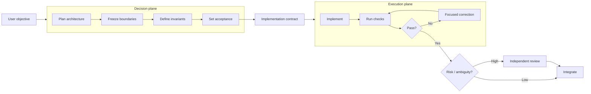
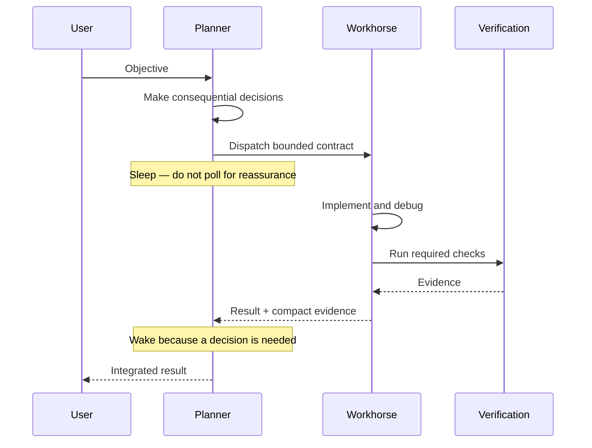
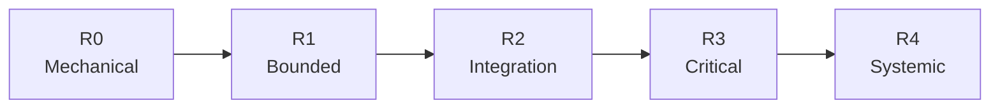
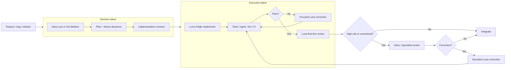

# Stop Using Your Best Model as a Worker

**A practical way to spend frontier reasoning on decisions and cheaper reasoning on execution**

*Waleed Dogar — September 12, 2026*

When I started using frontier coding models heavily, I defaulted to a simple rule: use the strongest model for the whole task. It felt safe. The planner was the implementer, the debugger, the reviewer, and often the process sitting around waiting for something else to finish.

That works, but once you use these tools all day, the economics start to matter. A large part of software work is important without being frontier-model work. Reading another file, applying an architecture that is already decided, fixing a test failure, running checks, or waiting for a worker does not always benefit from spending the scarcest model allowance available.

The workflow I have converged on is different:

> **Use frontier intelligence to make consequential decisions. Give a capable workhorse a bounded contract to execute. Bring frontier intelligence back only when the evidence or risk warrants it.**

That is the idea behind Durable Threads.

The important boundary is the **implementation contract**. Architecture lives on the left. Sustained execution lives in the middle. Expensive review is reintroduced on the right only when it earns its keep.

## Luna XHigh changed my default for implementation

In my own Codex use, GPT-5.6 Luna at XHigh reasoning has been much more capable as an implementation worker than the word *efficient* might suggest. I would not ask it to make every architectural decision blindly, but once the task is well specified, it can implement, debug, run focused checks, and correct itself extremely effectively.

That matters because the included allowance is very different across models. OpenAI currently estimates the following local-message ranges per five-hour period for ChatGPT Plus users in Work and Codex:

| Model | Estimated local messages / 5 hours |
| --- | ---: |
| GPT-6 Astra | 5–45 |
| GPT-5.6 Sol | 10–100 |
| GPT-5.6 Terra | 25–200 |
| GPT-5.6 Luna | 250–2,000 |

Those are **estimates, not fixed quotas**. OpenAI explicitly notes that context size, task complexity, reasoning effort, settings, and weekly limits can change consumption. Still, the order-of-magnitude difference changes how I think about a workflow. [OpenAI: Managing usage with GPT-6 Astra in Work and Codex](https://help.openai.com/en/articles/20001516)

Luna is also explicitly positioned by OpenAI as the cost-sensitive, high-volume member of the GPT-5.6 family. It supports reasoning through `xhigh` and `max`, with a 1.05M-token context window and up to 128K output tokens. [OpenAI: GPT-5.6 Luna](https://developers.openai.com/api/docs/models/gpt-5.6-luna)

This is **not** an argument that Luna is a better model than Astra. Astra is the stronger frontier model. The point is that model quality is only one term in the system-level optimization problem.

A useful mental model is:

> **Workflow value = accepted correct work ÷ (scarce allowance + latency + rework)**

That is not a formal benchmark metric. It is simply the question I care about when I have real work to ship and a finite allowance to ship it with.

If Luna XHigh can take a frozen design through implementation, tests, review, and one correction while Astra is reserved for the decisions where it materially changes the outcome, I can get more high-quality engineering work out of the same subscription.

## Freeze the decisions before you hand off the code

The biggest mistake in this pattern is giving the cheaper model a vague prompt and expecting it to rediscover the whole architecture.

“Implement refresh-token rotation” leaves a lot of product and security decisions unresolved. A better handoff says, in effect:

- Redis remains the state store.
- Replay invalidates the token family.
- Existing access-token behavior must not change.
- Refresh tokens must not be persisted in plaintext.
- Only `src/auth/**` and `tests/auth/**` are in scope.
- These exact tests and type checks define acceptance.

Now the workhorse is solving an implementation problem rather than simultaneously acting as product manager, architect, security reviewer, and programmer.

Durable Threads calls that a **bounded implementation contract**. The term is less important than the discipline: decisions, invariants, non-goals, allowed paths, and acceptance checks travel with the work.

## Treat the frontier model like an interrupt handler, not the CPU

Frontier reasoning has very high value when the cost of a wrong decision is high: architecture, ambiguous requirements, unsafe decomposition, auth boundaries, destructive migrations, concurrency, broad integration review, or repeated failures that suggest the plan itself may be wrong.

It has much less value when it is simply watching healthy execution.

This distinction becomes especially important with multi-agent workflows. Codex issue reports have documented cases where short `wait_agent` timeouts repeatedly return control to a parent model. If the parent is carrying a large context, every no-op wake-up can be expensive even though nothing changed. See [openai/codex#35108](https://github.com/openai/codex/issues/35108) and [openai/codex#41875](https://github.com/openai/codex/issues/41875).

A community investigation reported 47 no-op checks and millions of parent input tokens in one Astra-parent/Luna-worker run. That is one user's telemetry—not an OpenAI benchmark or a universal quota model—but it illustrates the failure mode well. [Community telemetry](https://www.reddit.com/r/codex/comments/1wa9c9d/i_investigated_why_gpt6_astra_burns_quota_so_fast/)

The response is a **sleeping orchestrator**:

The planner should wake because there is new information to reason about, not because another 30-second timer expired.

## Risk should buy review, not automatically buy an expensive implementer

Difficulty and consequence are not the same thing. A tricky algorithm behind a stable internal interface can be cognitively difficult but fairly contained. A one-line authorization change can be simple to type and still deserve independent frontier review.

Durable Threads uses five consequence classes:

| Risk | What it means | Typical examples | Default review posture |
| --- | --- | --- | --- |
| R0 | Mechanical | docs, formatting, narrow rename | machine checks |
| R1 | Bounded | isolated feature or bug fix | efficient review when useful |
| R2 | Integration | API contract, queue/cache, multi-module change | integration-focused review |
| R3 | Critical | auth, payments, privacy, destructive migration, concurrency | frontier/specialist review |
| R4 | Systemic | distributed state, control plane, recovery architecture | frontier architecture + final review |

The implementation worker can still be efficient at R3 or R4 if the contract is well bounded. The higher risk changes **who decides and who independently reviews**, not necessarily who types every line.

## Verify with machines before paying another model to feel confident

Another easy way to waste model capacity is to ask a reviewer to reason about something the toolchain can answer directly.

If a compiler, type checker, unit test, integration test, schema validator, static analyzer, migration check, or CI job can establish a property, run it first. A model review is most valuable after deterministic evidence has removed the obvious uncertainty.

The correction loop should also stay specific. “Try again” is a weak retry. “`test_refresh_replay` failed because descendants remain valid; preserve the existing state-store decision and fix only the replay invalidation path” is a bounded correction.

Escalation should work the same way. My default ladder is roughly:

**Efficient XHigh → Balanced Medium → Frontier Low → Frontier Medium**

I move up only when there is evidence: repeated acceptance failure, an unresolved architecture decision, a cross-module invariant that the packet missed, or a credible security finding. Frontier High/XHigh/Max is an exception, not a status symbol.

## The Plus workflow I actually want

For most substantial coding tasks, this is the shape I am aiming for:

I also keep Fast mode off when allowance longevity matters, avoid parallel writers unless the tasks are genuinely independent, and keep the frontier parent asleep while execution is healthy.

The point is not to make every workflow maximally complicated. For a small edit, I would often stay in the current session and do the work directly. Durable Threads should earn the handoff overhead rather than create ceremony for its own sake.

## What Durable Threads is trying to make repeatable

Durable Threads began as a way to preserve named worker sessions and compact handoffs across coding providers. The model-economics layer grew out of a more practical question: **how do I keep frontier-quality decision making without paying frontier-model economics for every minute of execution?**

The project now makes a few behaviors explicit: bounded contracts, consequence-based risk, sleeping orchestration, deterministic verification, durable worker identity, and evidence-gated escalation.

Some of those ideas are implementation policy, not settled science. The next step is measurement: matched tasks, same baselines, same acceptance checks, and enough repetitions to learn where Luna XHigh is genuinely the better workhorse and where the stronger model earns its cost earlier.

That distinction matters. I do not want Durable Threads to hard-code today's favorite model. I want it to encode a durable principle:

> **Spend the scarce intelligence where it changes the decision. Spend the abundant intelligence where the work simply needs to get done well.**

## Sources and caveats

- [OpenAI — Managing usage with GPT-6 Astra in Work and Codex](https://help.openai.com/en/articles/20001516)
- [OpenAI — GPT-5.6 Luna](https://developers.openai.com/api/docs/models/gpt-5.6-luna)
- [OpenAI — Models](https://developers.openai.com/api/docs/models)
- [OpenAI Codex #35108 — repeated parent turns during `wait_agent` polling](https://github.com/openai/codex/issues/35108)
- [OpenAI Codex #41875 — `wait_agent` timeout and prompt-cache behavior](https://github.com/openai/codex/issues/41875)
- [Community telemetry — Astra parent / Luna worker quota investigation](https://www.reddit.com/r/codex/comments/1wa9c9d/i_investigated_why_gpt6_astra_burns_quota_so_fast/)

OpenAI's allowance ranges and product behavior change over time. Community telemetry is anecdotal. The model-routing recommendations in this article are Durable Threads policy and my current operating preference, not an OpenAI guarantee or an official benchmark result.
