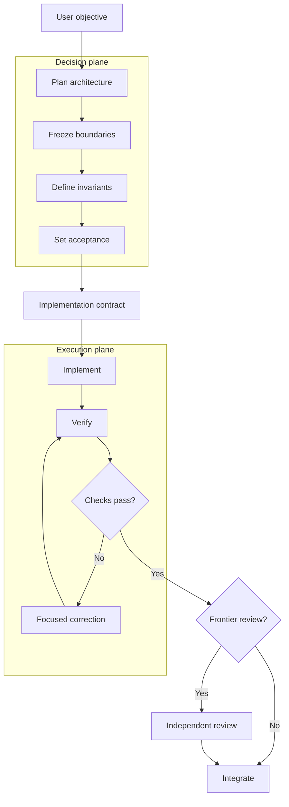
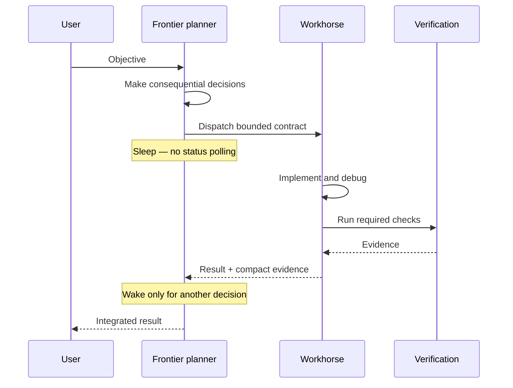
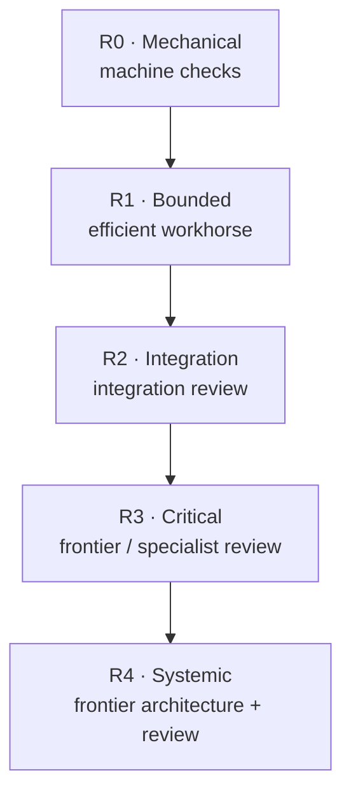
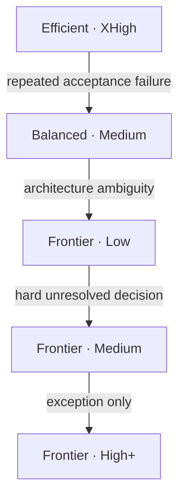
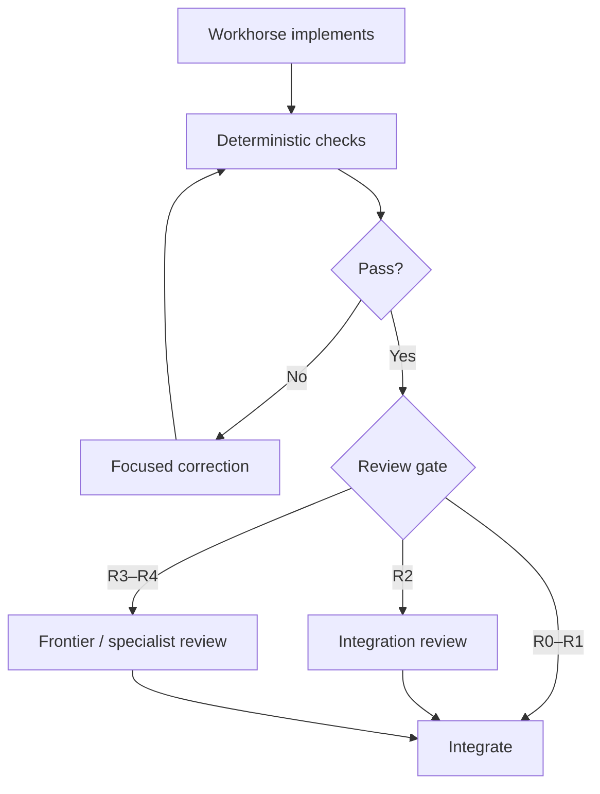
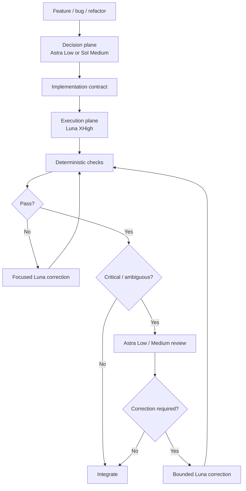

# Stop Using Your Best Model as a Worker

**Frontier decisions, cheap execution, and the architecture behind Durable Threads**

*Waleed Dogar — September 12, 2026*

The obvious way to use a frontier coding model is also one of the least efficient: give the best model the repository, ask it to build the feature, and let it stay in the loop until the work is done.

That works. It can also waste the scarcest part of a subscription allowance on activities that do not require frontier intelligence: reading files, waiting for workers, rerunning tests, formatting code, applying a known design, and making routine corrections.

A better architecture is to separate **decision work** from **execution work**.

> Expensive intelligence should make infrequent, high-leverage decisions. Efficient intelligence should own long-running execution.

That principle is the basis of the current Durable Threads design.

The contract is the boundary: make consequential decisions once, then let a workhorse own sustained execution.

## The surprising part: Luna XHigh is a serious implementation model

OpenAI describes GPT-5.6 Luna as the cost-sensitive, high-volume member of the GPT-5.6 family. It supports reasoning levels through `xhigh` and `max`, exposes a 1.05M-token context window, and supports up to 128K output tokens. On the API, its published token price is dramatically below the larger models. [OpenAI: GPT-5.6 Luna](https://developers.openai.com/api/docs/models/gpt-5.6-luna)

For ChatGPT Plus users working in Codex or Work, the more important number is the included allowance. OpenAI's September 2026 guidance estimates roughly 250–2,000 local Luna messages per five-hour period on Plus, compared with 5–45 for GPT-6 Astra, 10–100 for Sol, and 25–200 for Terra. OpenAI notes these are estimates rather than fixed caps and that task size, context, settings, reasoning effort, and weekly limits matter. [OpenAI: Managing usage with GPT-6 Astra in Work and Codex](https://help.openai.com/en/articles/20001516)

That changes the optimization problem.

If Astra is somewhat more likely to solve a bounded implementation task on the first try, but Luna XHigh lets you run an implementation pass, deterministic checks, a review pass, and a correction pass for a fraction of the same subscription allowance, then **first-pass model quality is no longer the only variable that matters**.

The objective becomes:

$$
\text{Workflow utility}
=
\frac{\text{accepted correct work}}
{\text{scarce allowance} + \text{latency} + \text{rework}}
$$

In practice, Luna XHigh is particularly compelling once the architecture has already been decided and the task has been converted into a bounded implementation contract.

## The frontier model should be an interrupt handler, not the CPU

The frontier model is most valuable when the cost of a wrong decision is large: choosing architecture, defining boundaries, deciding safe parallelism, identifying invariants, resolving ambiguity, reviewing high-risk changes, or deciding whether repeated worker failure means implementation error or a bad plan.

Those are high-decision-density activities.

The frontier model is much less valuable when it is polling another agent, waiting for tests, reopening known files, applying boilerplate, renaming symbols, formatting output, or repeatedly checking whether a worker has finished.

## Why active orchestration can burn quota

Recent Codex issue reports document a failure mode where short `wait_agent` timeouts repeatedly return control to the parent model. Each timeout can cause another parent inference over a large accumulated context even though no new worker result exists.

OpenAI Codex issue [#35108](https://github.com/openai/codex/issues/35108) describes nested `wait_agent` polling causing repeated parent turns and token usage. Issue [#41875](https://github.com/openai/codex/issues/41875) proposes aligning wait behavior with prompt-cache TTLs because short polling intervals can create many no-op parent turns during long worker tasks.

A detailed community telemetry post reported 47 no-op checks in one Astra-parent/Luna-worker run and attributed 7.13M parent input tokens to those checks. That is one user's measurement, not an OpenAI benchmark, but it is directionally consistent with the Codex issues. [Reddit: investigation into Astra quota consumption](https://www.reddit.com/r/codex/comments/1wa9c9d/i_investigated_why_gpt6_astra_burns_quota_so_fast/)

The architectural response is simple: **use a sleeping orchestrator**.

The frontier model should not remain awake merely to supervise healthy execution.

## Freeze decisions before implementation

Efficient models become far more reliable when they are not asked to rediscover architecture while coding.

Compare `Implement refresh-token rotation` with a contract that states the chosen state store, replay semantics, invariants, allowed paths, acceptance checks, and non-goals. The second prompt converts a fuzzy engineering problem into constrained execution. The worker still needs substantial reasoning, which is why Luna XHigh is useful, but it no longer has to act as product manager, architect, security reviewer, and implementor simultaneously.

Durable Threads calls this an **implementation contract**.

## Risk should determine where frontier intelligence is spent

Durable Threads uses five consequence classes:

| Risk | Meaning | Typical examples |
| --- | --- | --- |
| R0 | Mechanical | docs, formatting, typo, narrow rename |
| R1 | Bounded | isolated feature or bug fix |
| R2 | Integration | API contract, multiple modules, queues, caches, dependency changes |
| R3 | Critical | auth, payments, privacy, destructive migration, concurrency, production boundary |
| R4 | Systemic | architecture, distributed state, control plane, cross-service recovery |

A useful Plus-oriented default is efficient execution across all classes, with stronger planning/review as risk increases. R3/R4 are where frontier review earns its cost.

The exact model names will change. The architecture should not. That is why Durable Threads stores provider-neutral roles such as `efficient`, `balanced`, and `frontier` and resolves them against live model catalogs when possible.

## Escalate on evidence, not prestige

The economic escalation ladder should stay short:

Escalation is triggered by **failure evidence**: failed tests, repeated invariant violations, discovered shared state, or plausible security findings. "This task looks important" is not evidence that every token should be frontier-priced.

## Deterministic verification beats model confidence

If correctness can be checked with a compiler, type checker, unit test, integration test, schema validator, static analyzer, migration check, or CI workflow, use that machinery before paying another model to reason about the same property.

## Persistent threads are an economic primitive

Durable Threads maintains named worker identities and provider session IDs rather than replaying an entire planner transcript into each handoff. A persistent implementation worker can retain relevant local context while the planner sends only current facts. Research and security review can remain isolated from implementation reasoning.

Persistent sessions are useful when retained context is relevant. They are harmful when stale assumptions accumulate indefinitely. Worker identity is durable; stale context is not sacred.

## The workflow I use on Plus

Fast mode stays off when allowance longevity matters. Parallel workers are limited to independent tasks. The orchestrator sleeps while workers execute. Frontier reasoning is reintroduced at architectural and risk boundaries rather than kept permanently in the loop.

## This is not "use the cheapest model"

The goal is not cheapness. It is **economic correctness**.

Using an efficient model for an underspecified architecture problem can create more rework than it saves. Using Astra to poll two workers for twenty minutes can burn premium allowance without improving a line of code.

The correct question is:

> Where does another unit of frontier reasoning have the highest expected marginal value?

Sometimes the answer is the first five minutes. Sometimes it is the final security review. Often it is not the thirty minutes in between.

## What Durable Threads is becoming

Durable Threads started as a way to preserve named worker sessions and bounded evidence across Codex, Claude Code, Grok Build, and Cursor Agent.

The next layer is model economics: explicit execution classes, R0–R4 risk, evidence-gated escalation, frozen decisions/invariants, sleeping orchestration, deterministic verification, and outcome telemetry by task class/model/effort/rework/acceptance.

The long-term goal is not to hard-code today's favorite model. It is to learn, from measured outcomes, which model class and effort produces the most accepted work for the available budget.

## Sources and further reading

- [OpenAI — Managing usage with GPT-6 Astra in Work and Codex](https://help.openai.com/en/articles/20001516)
- [OpenAI — GPT-5.6 Luna model documentation](https://developers.openai.com/api/docs/models/gpt-5.6-luna)
- [OpenAI — Models](https://developers.openai.com/api/docs/models)
- [OpenAI Codex #35108 — repeated parent turns during wait_agent polling](https://github.com/openai/codex/issues/35108)
- [OpenAI Codex #41875 — align wait_agent timeout with prompt-cache TTL](https://github.com/openai/codex/issues/41875)
- [Community telemetry — Astra parent / Luna worker quota investigation](https://www.reddit.com/r/codex/comments/1wa9c9d/i_investigated_why_gpt6_astra_burns_quota_so_fast/)

Community measurements are observations, not official OpenAI guarantees. Model availability, limits, and product behavior change; check current OpenAI documentation before treating any allowance number as fixed.
