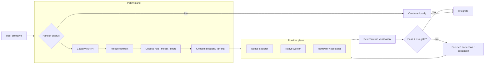
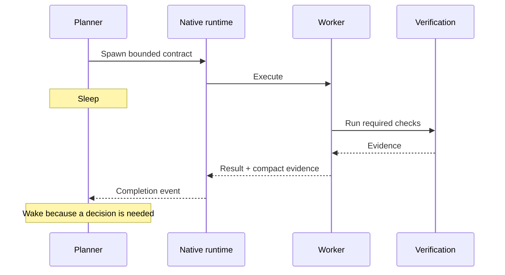

# Architecture

Durable Threads is a provider-neutral **policy layer** for bounded engineering work. It separates consequential decisions from sustained execution, preserves useful worker identity, and requires evidence before integration.

On current Codex, the preferred execution substrate is the host's native multi-agent runtime. Durable Threads owns the policy around delegation; Codex owns native subagent lifecycle.

## Design goals

1. Spend frontier-model capacity where it changes an important decision.
2. Keep sustained implementation on a capable workhorse when acceptance is well defined.
3. Prefer native subagent lifecycle and waiting when the host supports them.
4. Preserve useful worker context without replaying entire planner transcripts.
5. Bound fan-out, retries, and write ownership.
6. Separate parallel cognition from parallel mutation.
7. Prefer deterministic evidence over model confidence.
8. Keep routing explainable, benchmarkable, and provider-neutral.

## Three layers

### Policy plane

Durable Threads owns scope, architecture, consequence classification, decomposition, acceptance criteria, worker selection, model/effort policy, isolation policy, escalation, and integration. The planner should be decision-dense rather than remain active merely to observe progress.

### Runtime plane

The runtime executes the policy. In native Codex this includes subagent spawn, role application, waiting/resume behavior, sandboxing, shared project state, and worktree/session mechanics. External provider adapters remain available when intentionally requested.

### Verification plane

Deterministic checks establish what machines can establish before model review: compiler/type checker, focused tests, integration tests, schema/migration validation, lint/static analysis, and CI. Independent review is added when consequence or ambiguity justifies it.

## Core flow

## Native Codex mapping

Current Codex provides built-in `explorer` and `worker` roles. Durable Threads maps read-heavy codebase discovery to `explorer` and bounded implementation/debugging to `worker`. Review can use a project-defined read-only role when available; otherwise the default agent can receive an independent review contract.

The runtime should own native child lifecycle. Durable Threads should own **why a child exists, what it owns, and how its result will be accepted**.

## Sleeping orchestrator invariant

The planner must not sit in a short unchanged-state polling loop. On a capable native runtime, use its wait/notification lifecycle. Valid wake conditions are child completion, runtime failure, material new evidence, user steering, or a new consequential decision.

Repeated loops such as `wait -> timeout -> resample parent -> wait` are a policy failure when no new evidence is produced.

## Parallelism and workspace isolation

Use this rule:

> **Subagents for parallel cognition. Worktrees for parallel mutation.**

Read-only explorers and reviewers can usually share a checkout. One writer can use the shared checkout. Multiple independent writers should use isolated worktrees when supported and only when ownership is genuinely disjoint. Overlapping writers should be serialized.

Worktrees are an isolation primitive, not a proof of semantic independence.

## Configuration model

The normal plugin workflow does **not** require a roster or the Python helper.

Current Codex exposes native agent controls such as a concurrency cap and default subagent model/reasoning settings. Durable Threads treats those as runtime controls. Project-defined native agent roles can live under `.codex/agents/` when stable specialist behavior is useful.

For advanced provider-neutral use, a roster can still define planner/reviewer defaults, model-economic strategy, named workers, and safety limits.

## Risk layer

Risk is a **consequence classifier**, not a difficulty score: R0 mechanical, R1 bounded, R2 integration, R3 critical, R4 systemic. The helper can infer a conservative routing hint, and the planner can override it when repository facts are stronger than keywords.

See `RISK_ROUTING.md`.

## Packet layer

A worker packet contains the objective, consequence class, execution class, decisions already made, invariants, non-goals, allowed paths/ownership, acceptance checks, constraints, result contract, model/effort policy, and correction limit. It deliberately excludes a full transcript.

See `PACKET_CONTRACT.md`.

## Evidence layer

A complete result identifies changed paths, exact checks and outcomes, and remaining concerns. Durable Threads can compare reported paths with the actual git diff. A worker saying a check passed is not equivalent to executing that check.

## Session layer

Durability means retaining useful runtime/session identity and compact evidence while that context remains useful. It does not require Durable Threads to replace host-native session management. External provider session IDs remain local state and should not be committed.

## Managed API boundary

The OpenAI Agents API is a natural optional backend for headless, CI, SaaS, or automated execution because it exposes the Codex harness and multi-agent coordination. Normal plugin use should remain native and zero-config; an API key should not become a prerequisite simply because a managed backend exists.

## Provider neutrality

Native Codex is preferred when available. Claude Code, Grok Build, and Cursor remain optional runtime adapters. The project should map durable roles to provider capabilities without pretending lifecycle semantics are identical.

## Benchmark boundary

The important v0.5 comparison is **single Codex vs native multi-agent vs native multi-agent + Durable Threads policy**.

See `BENCHMARKING.md` and `VALIDATION.md`.
