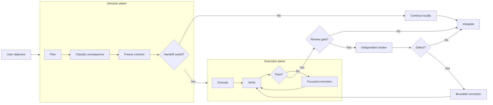
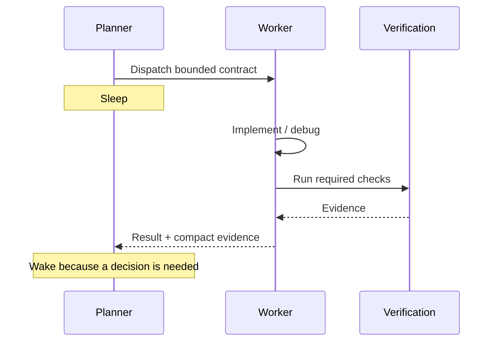

# Architecture

Durable Threads is a provider-neutral control layer for **bounded engineering work**. It separates consequential decisions from sustained execution, preserves useful worker identity, and requires evidence before integration.

The architecture is intentionally small: a decision plane creates a bounded contract; an execution plane owns the work; deterministic checks establish what machines can establish; independent review is added when consequence or ambiguity justifies it.

## Design goals

1. Spend frontier-model capacity where it changes an important decision.
2. Keep sustained implementation on a capable workhorse when acceptance is well defined.
3. Prevent expensive parent agents from burning turns while merely waiting.
4. Preserve useful worker context without replaying entire planner transcripts.
5. Bound fan-out, retries, and write scopes.
6. Prefer deterministic evidence over model confidence.
7. Keep routing explainable and benchmarkable.
8. Stay provider-neutral as model catalogs change.

## Decision plane and execution plane

The **decision plane** owns scope, architecture, consequence classification, decomposition, acceptance criteria, worker selection, escalation, and integration. It should be decision-dense: a frontier planner should not remain active just to watch a worker make progress.

The **execution plane** owns bounded implementation, focused debugging, local checks, research/documentation, and specialist tasks. Workers receive implementation contracts rather than the planner's full conversation.

## Core flow

The outer flow is left-to-right; the planes are internally top-to-bottom. This keeps the architecture readable without turning each plane into a wide chain.

## Sleeping orchestrator invariant

When enabled, the planner must not sit in a short unchanged-state polling loop. Valid wake conditions are worker completion, provider failure, material new evidence, user steering, or a wait boundary that genuinely requires another decision.

Repeated loops such as `wait → timeout → resample parent → wait` are exactly what this rule is designed to avoid. They can repeatedly re-enter a large parent context without producing new evidence.

## Configuration model

The normal plugin workflow does **not** require a roster or the Python helper.

For advanced use, a roster can define planner/reviewer defaults, a model-economic strategy, named workers, and safety limits. A strategy can include profile (`economy`, `balanced`, `frontier`), default risk, a frontier-review threshold, sleeping-orchestrator policy, and an escalation ladder. Worker records can include provider/session identity, role, model selector, reasoning effort, execution class, retry limit, and parallel eligibility.

## Risk layer

Risk is a **consequence classifier**, not a difficulty score: R0 mechanical, R1 bounded, R2 integration, R3 critical, R4 systemic. The helper can infer a conservative routing hint, and the planner can override it when repository facts are stronger than keywords.

See `RISK_ROUTING.md`.

## Packet layer

A worker packet contains the objective, consequence class, execution class, decisions already made, invariants, non-goals, allowed paths, acceptance checks, constraints, result contract, model/effort policy, and correction limit. It deliberately excludes a full transcript.

See `PACKET_CONTRACT.md`.

## Evidence layer

A complete result identifies changed paths, exact checks and outcomes, and remaining concerns. Durable Threads can compare reported paths with the actual git diff. A worker saying a check passed is not equivalent to executing that check.

## Session layer

Durability means retaining provider identity and compact evidence while that context remains useful. It does not guarantee remote-process recovery after quota failure, crashes, or unknown writer state. Session IDs are local state and should not be committed.

## Failure model

Hard stops include quota exhaustion, authentication failure, unknown writer state, session drift, exhausted corrections, path-scope violations, and unresolved ambiguity that invalidates the contract.

Do not rotate task IDs or provider sessions merely to bypass a stop.

## Provider neutrality

Codex can resolve `efficient`, `balanced`, and `frontier` against live model metadata. Other adapters use stable aliases only where the provider exposes them. The router must not invent model names.

## Security boundary

The packet allow-list is an instruction, not an OS sandbox. Inspect the actual diff. Push, merge, deploy, publish, account creation, and production changes require explicit user authorization.

## Benchmark boundary

Architecture claims remain hypotheses until matched evaluations support them. See `BENCHMARKING.md` and `VALIDATION.md`.
