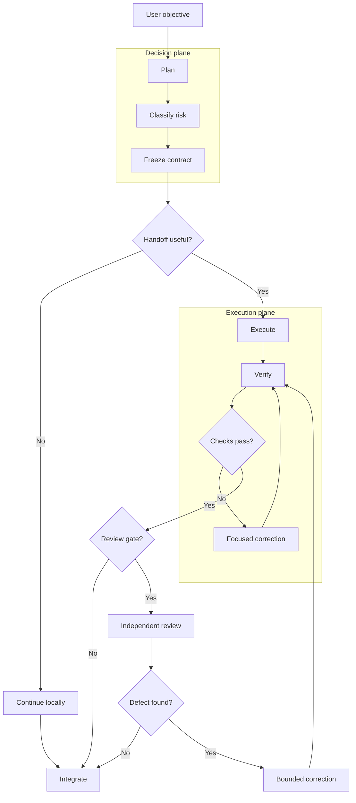
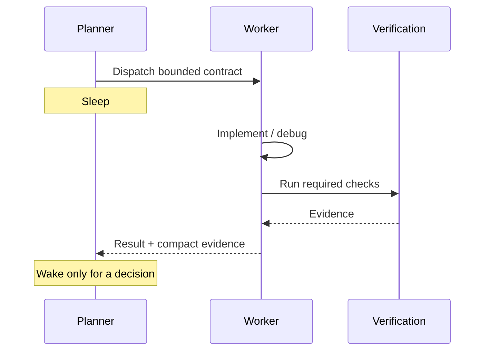

# Architecture

Durable Threads is a provider-neutral orchestration layer for **bounded, durable engineering work**. It separates consequential decisions from sustained execution, retains named provider sessions where useful, and requires evidence before integration.

## Design goals

1. Spend frontier-model capacity on decisions with high marginal value.
2. Keep long-running implementation on efficient workhorse models when they can satisfy acceptance checks.
3. Prevent expensive parent agents from burning context while polling healthy workers.
4. Preserve worker identity without replaying entire transcripts.
5. Bound fan-out, corrections, and write scopes.
6. Prefer deterministic verification over model confidence.
7. Make routing explainable and benchmarkable.
8. Stay provider-neutral as model names change.

## Decision plane and execution plane

The planner owns scope, architecture decisions, risk classification or override, decomposition, acceptance criteria, worker selection, escalation, and integration. The **decision plane** should be decision-dense. A frontier planner should not remain active merely to watch execution progress.

Workers own bounded implementation, focused tests, debugging, research/documentation, and specialist review. The **execution plane** receives implementation contracts, not the planner transcript.

## Core flow

The diagram intentionally keeps each plane vertical. The contract is the boundary: decisions are made once, then sustained execution happens below that boundary.

## Sleeping orchestrator invariant

When enabled, a planner must not remain in a short unchanged-state polling loop. Allowed wake conditions are worker completion, provider failure, material new evidence, user steering, or a bounded wait that genuinely requires another decision.

Repeated short timeouts such as `wait → timeout → resample parent → wait` are specifically what the sleeping-orchestrator policy is designed to avoid. They can repeatedly reprocess a large parent context without improving the result.

## Configuration model

A roster contains defaults for planner/reviewer, a model-economic strategy, named workers, and safety limits.

The strategy contains profile (`economy`, `balanced`, `frontier`), default risk, frontier-review threshold, sleeping-orchestrator setting, and an evidence-gated escalation ladder.

Workers contain role, provider, thread identity, purpose, model selector, effort, execution class, correction limit, and parallel eligibility.

The roster and Python helper are advanced controls. The normal plugin path does not require either one.

## Risk layer

Risk is a consequence classifier, not a difficulty classifier: R0 mechanical, R1 bounded, R2 integration, R3 critical, R4 systemic. The router can infer risk deterministically and the planner can override it.

See `RISK_ROUTING.md`.

## Packet layer

A worker packet contains objective, risk and execution class, decisions, invariants, non-goals, allowed paths, acceptance checks, constraints, result contract, model/effort policy, and correction limit. It deliberately excludes a full transcript.

See `PACKET_CONTRACT.md`.

## Evidence layer

A complete worker result must identify changed paths, exact checks, and remaining concerns. Durable Threads can compare reported paths with the actual git diff. The helper does not treat a worker's assertion that a check passed as equivalent to executing that check.

## Session layer

Durability means retaining provider identity and compact evidence, not assuming a remote process can always be recovered. Session IDs are local state and must not be committed.

## Failure model

Hard-stop conditions include quota exhaustion, authentication failure, unknown writer state, session drift, repeated failure after allowed corrections, path-scope violation, and unresolved ambiguity that invalidates the packet.

Do not rotate task IDs or provider sessions merely to bypass a stop.

## Provider neutrality

Codex can resolve `efficient`, `balanced`, and `frontier` against live model metadata. Other adapters use safe mappings only where the provider exposes stable aliases. The router must not invent model names.

## Security boundary

The packet allow-list is an instruction, not an OS sandbox. Inspect the actual diff. External actions such as push, merge, deploy, publishing, account creation, or production changes require explicit user authorization.

## Benchmark boundary

Architecture claims are hypotheses until measured. See `BENCHMARKING.md` and `VALIDATION.md`.
