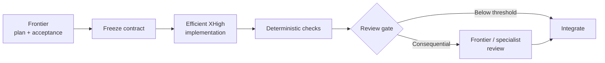

# Astra operating guide

Astra is a scarce frontier resource in the Durable Threads economy profile. Use it where additional reasoning can change an important decision—not as the default long-running executor.

This is role policy. It does not imply that every account/runtime has Astra or that Astra is always the right frontier choice.

## Availability

Check the live Codex catalog and current account allowance before selection. Use a model ID or tier the runtime actually exposes. If the preferred frontier model is unavailable, report that fact and use the declared fallback rather than guessing a versioned slug.

## Where frontier reasoning earns its cost

Good Astra use cases include architecture and decomposition, contradictory requirements, R3/R4 security/privacy/migration/production decisions, diagnosing repeated conceptual worker failure, and broad final integration review.

Poor Astra use cases include waiting for workers, polling status, routine code edits, rerunning known checks, formatting, or reviewing every small diff simply because Astra is available.

## Reasoning effort

A practical economy profile is:

| Effort | Use |
| --- | --- |
| `low` | default frontier planner or narrow consequential review |
| `medium` | difficult architecture or R3/R4 review |
| `high` | exceptional task with evidence that more exploration is useful |
| `xhigh` / `max` | benchmarked or pathological cases, not the default |

Higher effort can increase latency and allowance consumption. More reasoning is useful when the problem needs it, not as a universal quality switch.

## Frontier + workhorse pattern

## Sleeping orchestrator

A frontier parent should not burn turns monitoring healthy execution. Dispatch, wait through the provider's bounded/event-driven mechanism where available, and wake the frontier model only when material evidence requires another decision.

Related Codex reports:

- https://github.com/openai/codex/issues/35108
- https://github.com/openai/codex/issues/41875

## Context

Do not transfer an old transcript just because a larger context window can hold it. Give the frontier reviewer the current objective, frozen decisions, invariants, relevant paths, acceptance evidence, and the unresolved decision it needs to make.

## Current OpenAI references

- https://help.openai.com/en/articles/20001516
- https://developers.openai.com/api/docs/models

See `MODEL_ECONOMICS.md` for the provider-neutral policy.
