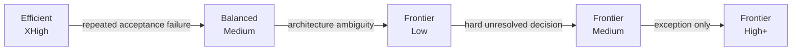

# Model economics

The goal is not to minimize tokens. It is to maximize **accepted, correct engineering work while preserving the scarce model capacity that matters most**.

> Put scarce intelligence on consequential decisions. Put sustained execution on the least expensive model/effort combination that reliably passes acceptance.

This is a project policy and an empirical hypothesis, not an OpenAI guarantee. Defaults should move when matched evaluations show a better route.

## Economic roles

| Execution class | Purpose | Typical work |
| --- | --- | --- |
| `decision` | high-leverage choices | architecture, decomposition, ambiguity resolution, escalation |
| `workhorse` | sustained execution | implementation, debugging, tests, routine refactors |
| `review` | independent acceptance | diff review, integration review, acceptance validation |
| `specialist` | domain-specific high-risk analysis | security, privacy, destructive migrations, recovery |

A model can serve more than one role. The point of the classes is to make the intended economics explicit rather than letting the strongest available model become the default for every step.

## Current Plus-oriented starting point

As of September 2026, a useful starting policy for users optimizing included ChatGPT Plus allowance in Codex/Work is:

| Work | Starting policy |
| --- | --- |
| routine or bounded implementation | efficient + high/XHigh |
| focused debugging | efficient + high/XHigh |
| tests and mechanical validation | efficient + high when model reasoning is needed; deterministic tools first |
| difficult general planning | balanced + medium |
| first-line model review | efficient + high/XHigh |
| consequential architecture or R3/R4 review | frontier + low/medium |
| frontier high/XHigh/max | evidence-gated exception |

With OpenAI's current family, this can map to Luna XHigh for sustained execution and Astra Low/Medium for consequential decisions. Do not hard-code those names when a live catalog is available.

## Why efficient XHigh execution can work

A workhorse should not be asked to rediscover the whole product problem. Before dispatch, the planner should have resolved important architecture choices and supplied bounded paths, acceptance checks, invariants, and non-goals.

That changes the search space. High reasoning effort on an efficient model is being spent on **how to execute a chosen design**, not on repeatedly deciding what the design should be.

The relevant outcome is final accepted correctness after verification, including corrections—not first-pass prestige.

## Evidence-gated escalation

Keep the default ladder short:

Concrete escalation evidence includes repeated acceptance failures, missing architecture decisions, conflicting parallel tasks, cross-module invariant failures, credible security findings, or an inability to make a critical change reversible.

Do not escalate simply because the task looks important.

## Sleeping orchestrator

When `strategy.sleepingOrchestrator` is true, the planner should decide, dispatch, and then wait without repeated no-op parent resampling. Wake on completion, failure, material evidence, or another real decision boundary.

Relevant Codex reports:

- https://github.com/openai/codex/issues/35108
- https://github.com/openai/codex/issues/41875

## Fast mode

When allowance longevity matters, keep Fast mode off by default. Fast mode is a latency choice and consumes included allowance faster; it is not an intelligence upgrade.

## Context economics

A large context window is capacity, not a target. Prefer compact contracts, retained sessions while their context is still relevant, exact path scopes, summaries of failed approaches, and a fresh bounded worker when old context becomes misleading.

## Measuring value

Record what the provider actually exposes: input tokens, cached input, output tokens, reasoning tokens, wall time, model turns, parent turns, selected workers, follow-ups, deterministic failures, review defects, corrections, first-pass acceptance, final acceptance, model selector/effort, task class, and risk class.

Do not infer subscription savings from packet size alone. Compare matched tasks against a direct retained-session baseline and keep correctness gates identical.

## Current OpenAI references

- https://help.openai.com/en/articles/20001516
- https://developers.openai.com/api/docs/models/gpt-5.6-luna
- https://developers.openai.com/api/docs/models
- https://github.com/openai/codex/issues/35108
- https://github.com/openai/codex/issues/41875

Product limits and model availability change. Treat current numbers as dated inputs, never permanent constants.
