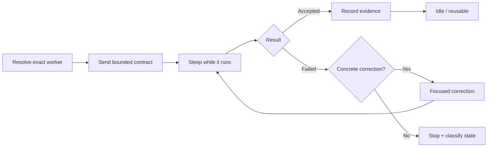

# Persistent thread lifecycle

## What durable means

Durable Threads preserves stable worker identity, provider, provider session ID, task status, compact evidence, and usage counters when available. It does **not** promise provider-process recovery after quota failure, crashes, or unknown writer state.

## Why persistence matters

A useful persistent worker can retain provider-local context without forcing the planner to replay a large transcript. That is economically useful only while the retained context remains relevant.

## Lifecycle

Durability is stable identity plus useful context—not keeping every worker alive forever.

## Resolve

1. List current provider tasks/sessions.
2. Match the exact worker title and provider.
3. Confirm the project directory and idle/finished state.
4. Confirm the worker's purpose still matches the new contract.
5. Reuse the session only if retained context is still useful.
6. Ask before creating a new provider task when policy requires authorization.

Never treat a merely similar title as the same worker.

## Send

Send one bounded contract with a new run ID for new work. Include objective, risk, frozen decisions, invariants, non-goals, allowed paths, acceptance, constraints, and result contract. Do not send the planner transcript by default.

## Wait

The orchestrator should sleep while the worker runs. Prefer event-driven completion when the provider supports it. Avoid short repeated timeouts or transcript rereads that return the parent model to unchanged state.

## Resume

Resume for a focused correction only when provider metadata is valid, resume is supported, the failure is concrete, and the correction count remains within policy. Name the failed check and violated invariant; do not resend the full original packet unless material facts changed.

## New objective vs correction

A distinct objective can reuse an idle worker with a new task record. A correction repairs the same acceptance failure. Do not rotate IDs to bypass retry policy.

## Recovery states

| State | Action |
| --- | --- |
| idle/finished | send a new bounded objective |
| active writer | wait for material state change |
| usage limit | record stop; wait for reset or declared fallback |
| missing provider metadata | do not resume blindly |
| provider failure | classify before retry |
| unknown status | inspect once, then stop writes until resolved |

## Retirement

Retire or archive a worker only when requested or when policy defines retirement. Preserve redacted ledger history so routing evaluations remain auditable.
