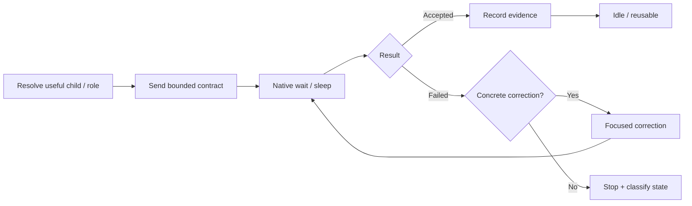

# Persistent thread lifecycle

## What durable means now

Durability is no longer the primary differentiator on modern Codex because the host runtime already owns native subagent/session lifecycle. Durable Threads uses persistence as an **economic context primitive**: retain useful child identity and evidence when that saves rediscovery, but do not keep agents alive merely for the sake of continuity.

For external providers, Durable Threads can still preserve provider session IDs and bounded ledger state. For native Codex, prefer the runtime's own child/session mechanisms.

## Why persistence still matters

A useful child can retain local context without forcing the planner to replay a large transcript. That is valuable only while the retained context remains relevant and trustworthy.

## Lifecycle

Durability means stable identity plus useful context—not keeping every worker alive forever.

## Resolve

For native Codex, prefer the runtime's existing child/session identity. For external providers, match the exact provider/session ID and working directory.

Reuse only when:

1. the prior child is idle/finished;
2. its purpose still matches the new objective;
3. retained context is more useful than a fresh bounded child;
4. there is no ambiguity about prior writes or state.

## Send

Send one bounded contract with a new run ID for new work. Include objective, risk, frozen decisions, invariants, non-goals, ownership/allowed paths, acceptance, constraints, and result contract. Do not send the planner transcript by default.

## Wait

Use native event/wait semantics when available. The planner should sleep while the child runs and wake on completion, failure, user steering, or material evidence. Avoid short repeated timeouts or transcript rereads that return the parent model to unchanged state.

## Resume

Resume for a focused correction only when the failure is concrete and the correction count remains within policy. Name the failed check and violated invariant. Do not resend the full packet unless material facts changed.

## New objective vs correction

A distinct objective can reuse an idle child when retained context is still relevant. A correction repairs the same acceptance failure. Do not rotate IDs or child identities merely to bypass retry policy.

## Recovery states

| State | Action |
| --- | --- |
| idle/finished | reuse only if retained context is useful |
| active writer | wait for material state change |
| usage limit | record stop; wait for reset or declared fallback |
| missing provider/session metadata | do not resume blindly |
| provider/runtime failure | classify before retry |
| unknown writer state | stop new writes until resolved |

## Worktrees and durability

A durable worker identity and an isolated worktree solve different problems. Identity preserves useful context; a worktree isolates mutations. For independent parallel writers, prefer both when available: stable task ownership plus isolated checkout. Overlapping writers should still be serialized.

## Retirement

Retire or archive a child when its retained context has become stale, its objective class changed materially, or policy defines retirement. Preserve redacted evidence/benchmark history where useful for routing evaluation.
