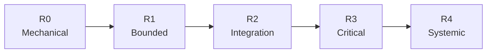

# Risk-aware routing

Durable Threads separates **task difficulty** from **task consequence**. A difficult algorithm behind a stable internal interface can be contained; a one-line authorization predicate can be critical.

Risk determines how much independent reasoning and review the workflow buys. It does not automatically determine which model writes every line of code.

## Risk ladder



| Class | Meaning | Default posture |
| --- | --- | --- |
| R0 | docs, formatting, deterministic rename | local/efficient execution + deterministic checks |
| R1 | isolated feature, bug, local refactor | efficient high-reasoning workhorse + focused checks |
| R2 | API contract, queue/cache, dependency or multi-module change | stronger planning + integration-focused review |
| R3 | auth, payments, credentials, privacy, destructive migration, concurrency | frontier planning when ambiguous + independent specialist/frontier review |
| R4 | distributed state, control plane, multi-region/recovery design | frontier architecture/final review + bounded workhorse execution |

## Deterministic classifier

`durable_threads.risk.classify_risk` uses inspectable keyword signals and accepts an explicit override. It intentionally does not call a model. The result is a routing hint, not a security boundary.

## Frontier review threshold

`strategy.frontierReviewAt` sets the minimum risk where the helper recommends frontier review. The default economy profile uses `R3`:

```json
{
  "strategy": {
    "profile": "economy",
    "defaultRisk": "R1",
    "frontierReviewAt": "R3",
    "sleepingOrchestrator": true
  }
}
```

## Difficulty is separate

Model effort addresses cognitive difficulty. Risk addresses blast radius and review posture. These axes often correlate, but they are not the same thing.

Examples:

| Task | Risk | Suggested route |
| --- | --- | --- |
| README typo | R0 | local or one efficient worker |
| isolated parsing bug | R1 | efficient/XHigh implementation + tests |
| webhook contract change | R2 | balanced planning, efficient/XHigh execution, integration review |
| refresh-token replay fix | R3 | frontier low/medium planning, efficient/XHigh execution, frontier review |
| multi-region failover redesign | R4 | frontier medium/high planning, bounded workers, frontier final review |

## Override discipline

Record explicit risk overrides with the plan. If you lower an automatically detected R3/R4 class, state why repository facts make the lower class appropriate. Do not lower risk just to avoid frontier usage.
