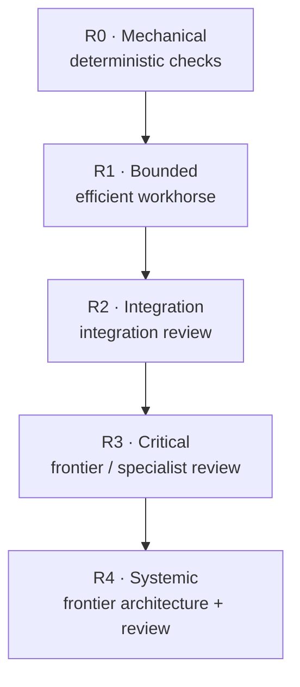

# Risk-aware routing

Durable Threads separates **task difficulty** from **task consequence**. A mechanically simple change can still be high risk if it touches authentication, payments, privacy, destructive data operations, concurrency, or production recovery.

Risk controls how much independent reasoning and review the workflow buys.

## Risk ladder



Higher risk means stronger independent review by default. It does **not** automatically mean the implementation worker must be a frontier model.

## Risk classes

### R0 — mechanical

Documentation-only edits, formatting, typo correction, narrow comments, or deterministic renames. Default posture: local execution or one efficient worker plus deterministic verification.

### R1 — bounded

Isolated feature work, focused bug fixes, self-contained components, or local refactors with stable interfaces. Default posture: efficient/xhigh workhorse, focused checks, efficient review when useful.

### R2 — integration

Public API contracts, webhooks, queues/caches, dependency upgrades, multi-module changes, or non-destructive schema interaction. Default posture: stronger planning, efficient/xhigh execution, integration checks, independent review.

### R3 — critical

Authentication/authorization, payments, credentials, PII/privacy, destructive migration paths, concurrency/locking/races/idempotency, and production security boundaries. Default posture: frontier planning where ambiguity exists, efficient/xhigh execution, deterministic verification, frontier/specialist review.

### R4 — systemic

Distributed architecture, multi-region state, control-plane/data-plane changes, cross-service consistency, platform migrations, and disaster recovery. Default posture: frontier planning/final review with bounded workhorse execution between decision points.

## Deterministic classifier

`durable_threads.risk.classify_risk` uses inspectable keyword signals and accepts an explicit override. It intentionally does not call a model. This is a routing hint, not a security boundary.

## Frontier review threshold

`strategy.frontierReviewAt` defines the minimum risk where the plan should recommend frontier review. The default economy profile uses `R3`.

```json
{
  "strategy": {
    "profile": "economy",
    "defaultRisk": "R1",
    "frontierReviewAt": "R3",
    "sleepingOrchestrator": true
  }
}
```

## Difficulty is separate

A difficult algorithm behind a stable interface may be R1/R2. A one-line authorization predicate may be R3. Model effort addresses cognitive difficulty; risk determines consequence and review posture.

## Routing examples

| Task | Risk | Suggested route |
| --- | --- | --- |
| README typo | R0 | local or one efficient worker |
| isolated parsing bug | R1 | efficient/xhigh implementation + tests |
| webhook contract change | R2 | balanced planning, efficient/xhigh execution, integration review |
| refresh-token replay fix | R3 | frontier low/medium planning, efficient/xhigh execution, frontier review |
| multi-region failover redesign | R4 | frontier medium/high planning, bounded workers, frontier final review |

## Override discipline

An explicit risk override should be recorded with the plan. Lowering an automatically detected R3/R4 class should state why. Do not lower risk simply to avoid frontier usage.
